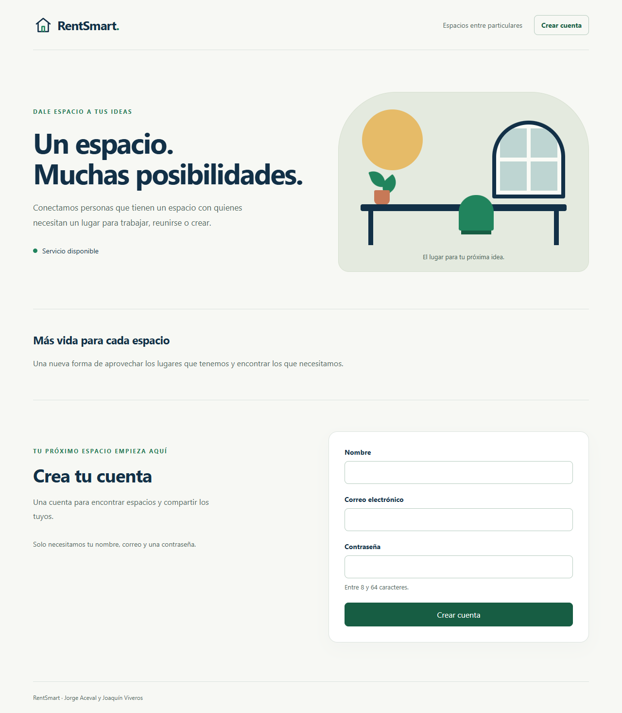
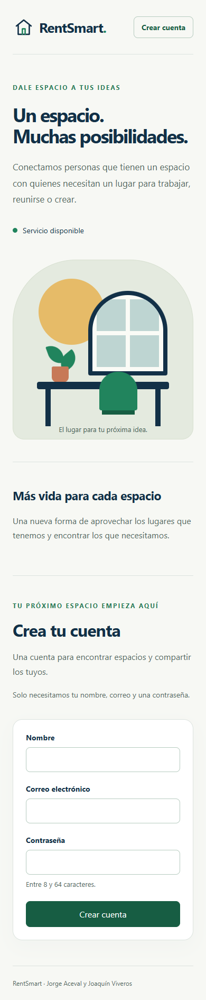

# HU-01 — Registrarse (REN-1)

Como visitante, quiero crear una cuenta con mi nombre, correo y contraseña para poder publicar espacios y realizar reservas.

Fuente: `Historias de usuario.pdf`, página 7, y rangos comunes de las páginas 3 y 4. Tarea: [REN-1](https://rentsmartpsf.atlassian.net/browse/REN-1). Los requisitos y el flujo de uso están en [requerimientos.md](requerimientos.md).

## Comportamiento disponible

Implementamos la sección **Crear cuenta** en la página inicial, con los tres campos y sus mensajes de error. Al completar el registro, mostramos la confirmación y limpiamos el formulario. El registro no inicia una sesión automáticamente. Tenemos pendiente la navegación al inicio de sesión de CA-01, que depende de HU-02.

Recortamos los espacios exteriores del nombre y validamos que tenga entre 2 y 80 caracteres. También recortamos el correo y lo convertimos a minúsculas; debe ser válido y único. Para la contraseña exigimos entre 8 y 64 caracteres, conservamos exactamente lo ingresado y guardamos un hash Argon2id.

Generamos el UUID en el servidor y creamos la cuenta con `is_admin=false`. Limitamos el registro público a nombre, correo y contraseña. Implementaremos las funciones de publicación y reserva en sus respectivas historias.

## Contrato de API

`POST /api/auth/register` recibe `name`, `email` y `password`.

| Código | Resultado |
| --- | --- |
| `201` | Cuenta creada; respuesta con `id`, `name` y `email` |
| `409` | Correo ya registrado; error asociado a `email` |
| `422` | Datos inválidos o campos adicionales; mensajes por campo |
| `503` | Persistencia no disponible; mensaje controlado |

Devolvemos los errores con `detail` y `errors`. Excluimos de las respuestas los valores enviados, las contraseñas, los hashes y los detalles internos de conexión.

Creamos la migración `0001_create_users` para definir la tabla y las restricciones de unicidad, correo normalizado y longitud de nombre. Usamos `uq_users_email` para resolver los registros simultáneos en PostgreSQL; la sesión que encuentra el conflicto revierte su transacción. Preparamos la respuesta pública antes del commit y la devolvemos después de guardar la cuenta.

Los textos deben poder codificarse como UTF-8. El nombre no acepta NUL y el correo se ingresa como dirección simple, sin nombre visible ni delimitadores `< >`.

## Interfaz

Documentamos la instalación y los comandos en el [README](../README.md). Registramos los resultados de ejecución en **Testing** de Jira y en el [PR #4](https://github.com/JorgeJaceval/Pruebas-De-Software-RentSmart/pull/4).
