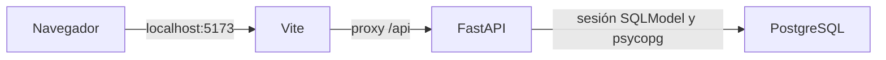

# Base de desarrollo de RentSmart

En REN-73 construimos la base ejecutable con React, TypeScript, Vite, FastAPI, PostgreSQL y SQLModel. Agregamos una página inicial que comprueba si la API puede consultar PostgreSQL y permite reintentar cuando hay un fallo.

## Comunicación entre servicios

Configuramos el proxy de Docker para apuntar a `http://backend:8000` y el backend para conectar a `db:5432`. En desarrollo local, usamos `http://127.0.0.1:8000` como destino del proxy y publicamos PostgreSQL en `127.0.0.1:15432`.

## Backend

- `app/main.py` crea FastAPI, registra CORS y monta las rutas bajo `/api`.
- `app/settings.py` lee las variables de entorno y construye la URL PostgreSQL sin concatenar credenciales, de modo que los caracteres especiales de la contraseña se codifican correctamente.
- `app/database.py` crea el motor y proporciona una sesión SQLModel por solicitud, cerrándola al terminar.
- `app/routers/health.py` expone las comprobaciones de funcionamiento y conexión.
- `app/routers/auth.py` implementa el registro de cuentas, con respuestas que excluyen datos sensibles.
- `app/models.py` define la cuenta única, que puede participar como propietaria o arrendataria según la operación; `is_admin` se establece en `false` en el registro público.
- `app/security.py` genera y verifica hashes Argon2 mediante pwdlib. La contraseña se procesa sin recortarla.
- `app/schemas.py` valida tipos, longitudes y Unicode codificable; rechaza NUL en nombre y correo con nombre visible. `app/errors.py` traduce esos fallos a mensajes fijos por campo, sin publicar entradas.
- `migrations/` contiene el historial Alembic del esquema y las restricciones de PostgreSQL.

| Endpoint | Propósito | Resultado |
| --- | --- | --- |
| `GET /api/health` | Comprobar la API sin depender de PostgreSQL | `200`, `{"status":"ok","service":"rentsmart-api"}` |
| `GET /api/health/ready` | Comprobar una consulta real mediante SQLModel | `200`, `{"status":"ok","database":"connected"}` |
| `GET /api/health/ready` con fallo de base de datos | Comunicar indisponibilidad | `503`, mensaje sin datos de conexión |
| `POST /api/auth/register` | Registrar nombre, correo y contraseña | `201`, cuenta con `id`, `name` y `email` |
| Registro con correo repetido | Conservar una única cuenta | `409`, error asociado a `email` |
| Registro con datos inválidos o campos adicionales | Rechazar el registro | `422`, errores por campo sin copiar el contenido enviado |
| Registro con fallo de base de datos | Comunicar indisponibilidad | `503`, mensaje genérico |

La documentación interactiva se publica en `/docs` y el contrato OpenAPI en `/openapi.json`. Las variables se encuentran en `backend/.env.example`; las URLs autorizadas para CORS se configuran con `CORS_ORIGINS` como una lista JSON.

## Frontend

`src/api.ts` comprueba tanto el código HTTP como el contenido de la respuesta. `src/App.tsx` presenta los estados de comprobación, disponibilidad e indisponibilidad. Las solicitudes se cancelan al desmontar el componente y cada reintento inicia una comprobación nueva.

Usamos `API_PROXY_TARGET` en Vite para dirigir `/api` al backend. Construimos la interfaz con React y TypeScript y probamos el formulario con Jest y React Testing Library, simulando `fetch`. Reservamos la configuración de Playwright para la entrega 3.

`src/RegistrationForm.tsx` mantiene los datos del formulario en memoria, valida antes de enviar, asocia los errores a cada campo y evita solicitudes duplicadas mientras se registra la cuenta. `src/registration.ts` envía exclusivamente `name`, `email` y `password` a `/api/auth/register`. Nombre y correo se normalizan; la contraseña conserva todos sus caracteres. El éxito limpia los campos y no guarda tokens ni contraseñas en almacenamiento del navegador.

## Migraciones y datos

Desde `backend`, ejecuta `uv run alembic upgrade head` para aplicar las migraciones y `uv run alembic current` para consultar la revisión instalada. Docker ejecuta la actualización antes de iniciar Uvicorn. `uv run alembic check` permite comprobar diferencias entre los modelos y el esquema instalado.

La revisión `0001_create_users` crea `users`, con UUID generado por la aplicación, nombre, correo, hash de contraseña y flag administrativo. La restricción `uq_users_email` garantiza unicidad en la base incluso con solicitudes simultáneas. `ck_users_email_normalized` exige correos en minúsculas y sin espacios exteriores. No hay procedimientos que borren cuentas al iniciar o reiniciar el backend.

## Dependencias reproducibles

Versionamos `frontend/package-lock.json` y `backend/uv.lock` para mantener instalaciones reproducibles. Usamos `npm ci` para el frontend y `uv sync --frozen` para el backend. Trabajamos con Node.js 24 y Python 3.12.

Configuramos un override de `js-yaml` para evitar dependencias antiguas dentro de la cadena de paquetes de Jest.

## Pruebas y CI

Documentamos los comandos en el [README](../README.md) y configuramos dos trabajos en GitHub Actions:

- `frontend`: instalación con lockfile, TypeScript, build de Vite y pruebas Jest del formulario.
- `backend`: instalación con lockfile, migraciones y pruebas Pytest de registro con un servicio PostgreSQL real.

Probamos la API con `TestClient` y PostgreSQL real. Reemplazamos la dependencia de sesión para usar un esquema independiente por prueba, con las mismas migraciones de la aplicación. Eliminamos el esquema al terminar; las cuentas existentes quedan fuera de ese esquema.

Reservamos las E2E para la entrega 3 y conservamos la configuración de Playwright para preparar esos recorridos. Registramos los resultados actuales en el PR y en **Testing** de Jira.

## Resolver problemas de arranque

- **Docker no conecta al motor:** inicia Docker Desktop y selecciona contenedores Linux antes de ejecutar Compose.
- **El puerto PostgreSQL está ocupado o bloqueado:** cambia `POSTGRES_PORT` en el `.env` de la raíz y `DATABASE_PORT` en `backend/.env` si ejecutas la API localmente. El valor de desarrollo es `15432`.
- **La API devuelve 503:** comprueba `docker compose ps`, las credenciales y `docker compose logs db backend`. `/api/health` permite distinguir el estado de la API del estado de PostgreSQL.
- **Cambiaste credenciales después de crear el volumen:** PostgreSQL conserva los usuarios existentes; actualiza sus credenciales en la base o usa un volumen nuevo para otra instancia de desarrollo.
- **PowerShell bloquea npm:** ejecuta `npm.cmd` y `npx.cmd`; uv evita tener que activar un entorno con scripts PowerShell.
- **Playwright no encuentra Chromium:** ejecuta `npx playwright install chromium` antes de las pruebas E2E.
- **Fallo al instalar dependencias:** usa las versiones de Node.js y Python indicadas y los comandos con lockfile del README.
