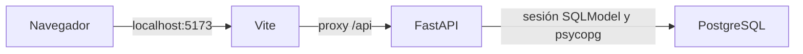

# Base de desarrollo de RentSmart

REN-73 establece el esqueleto ejecutable con React, TypeScript, Vite, FastAPI, PostgreSQL y SQLModel. Incluye una página inicial que comprueba si la API puede consultar PostgreSQL y permite reintentar cuando hay un fallo.

## Comunicación entre servicios

En Docker, el proxy apunta a `http://backend:8000` y el backend conecta a `db:5432`. En desarrollo local, el proxy apunta a `http://127.0.0.1:8000` y PostgreSQL se publica en `127.0.0.1:15432`.

## Backend

- `app/main.py` crea FastAPI, registra CORS y monta las rutas bajo `/api`.
- `app/settings.py` lee las variables de entorno y construye la URL PostgreSQL sin concatenar credenciales, de modo que los caracteres especiales de la contraseña se codifican correctamente.
- `app/database.py` crea el motor y proporciona una sesión SQLModel por solicitud, cerrándola al terminar.
- `app/routers/health.py` expone las comprobaciones de funcionamiento y conexión.

| Endpoint | Propósito | Resultado |
| --- | --- | --- |
| `GET /api/health` | Comprobar la API sin depender de PostgreSQL | `200`, `{"status":"ok","service":"rentsmart-api"}` |
| `GET /api/health/ready` | Comprobar una consulta real mediante SQLModel | `200`, `{"status":"ok","database":"connected"}` |
| `GET /api/health/ready` con fallo de base de datos | Comunicar indisponibilidad | `503`, mensaje sin datos de conexión |

La documentación interactiva se publica en `/docs` y el contrato OpenAPI en `/openapi.json`. Las variables se encuentran en `backend/.env.example`; las URLs autorizadas para CORS se configuran con `CORS_ORIGINS` como una lista JSON.

## Frontend

`src/api.ts` comprueba tanto el código HTTP como el contenido de la respuesta. `src/App.tsx` presenta los estados de comprobación, disponibilidad e indisponibilidad. Las solicitudes se cancelan al desmontar el componente y cada reintento inicia una comprobación nueva.

Vite usa `API_PROXY_TARGET` para dirigir `/api` al backend. React, TypeScript y Vite construyen la aplicación; Jest con React Testing Library comprueba la interacción con la API, y Playwright ejecuta los recorridos en Chromium.

## Dependencias reproducibles

`npm ci` instala las versiones de `frontend/package-lock.json`. `uv sync --frozen` instala las versiones de `backend/uv.lock`. Ambos lockfiles están versionados. El frontend requiere Node.js 24 y el backend usa Python 3.12.

El override de `js-yaml` para `@istanbuljs/load-nyc-config` evita la cadena antigua `argparse`/`sprintf-js` que usa la configuración de cobertura de Jest. La interfaz `load` utilizada por ese paquete está disponible en la versión instalada.

## Pruebas y CI

Las instrucciones ejecutables están en el [README](../README.md). GitHub Actions comprueba tres trabajos:

- `frontend`: instalación con lockfile, TypeScript, build de Vite y pruebas Jest.
- `backend`: instalación con lockfile y Pytest, con un servicio PostgreSQL real.
- `e2e`: API, Vite y Chromium, con un servicio PostgreSQL real.

Las pruebas rápidas de API reemplazan la dependencia de sesión por una base SQLite en memoria. La prueba marcada `postgres` utiliza el motor PostgreSQL de la aplicación sin reemplazos. Las pruebas E2E comprueban la integración completa y la recuperación de la interfaz ante una respuesta `503`.

## Resolver problemas de arranque

- **Docker no conecta al motor:** inicia Docker Desktop y selecciona contenedores Linux antes de ejecutar Compose.
- **El puerto PostgreSQL está ocupado o bloqueado:** cambia `POSTGRES_PORT` en el `.env` de la raíz y `DATABASE_PORT` en `backend/.env` si ejecutas la API localmente. El valor de desarrollo es `15432`.
- **La API devuelve 503:** comprueba `docker compose ps`, las credenciales y `docker compose logs db backend`. `/api/health` permite distinguir el estado de la API del estado de PostgreSQL.
- **Cambiaste credenciales después de crear el volumen:** PostgreSQL conserva los usuarios existentes; actualiza sus credenciales en la base o usa un volumen nuevo para otra instancia de desarrollo.
- **PowerShell bloquea npm:** ejecuta `npm.cmd` y `npx.cmd`; uv evita tener que activar un entorno con scripts PowerShell.
- **Playwright no encuentra Chromium:** ejecuta `npx playwright install chromium` antes de las pruebas E2E.
- **Fallo al instalar dependencias:** usa las versiones de Node.js y Python indicadas y los comandos con lockfile del README.
