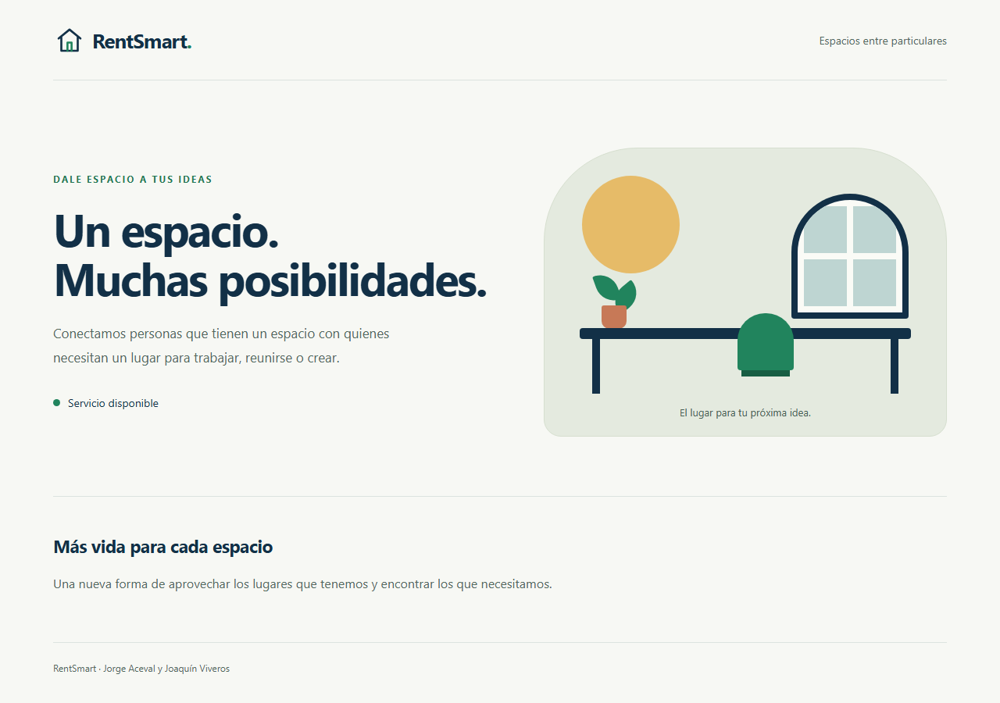
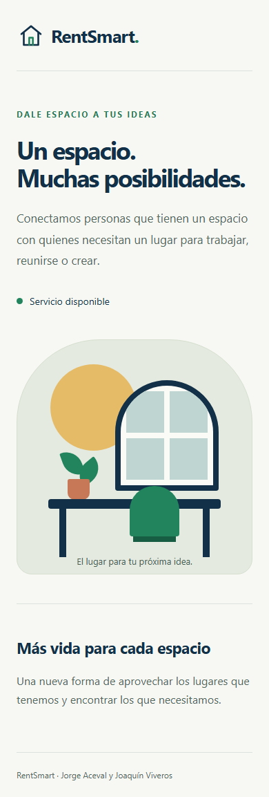

# Evidencia de REN-73

Verificación realizada el 6 de octubre de 2026 para el esqueleto con React, TypeScript, Vite, FastAPI, PostgreSQL y SQLModel.

Esta evidencia registra la ejecución original de REN-73. Al implementar HU-01 / REN-1 se ajustó el alcance indicado por el equipo: las E2E corresponden a la entrega 3 y su trabajo dejó de ejecutarse en el pipeline. Los resultados actuales se encuentran en [REN-1](REN-1.md).

## Resultados

| Comprobación | Resultado |
| --- | --- |
| Instalación limpia `npm ci` en Windows y Linux | Correcta |
| TypeScript y compilación Vite en Windows y Linux | Correctos |
| Jest y React Testing Library | 4 pruebas aprobadas en ambos sistemas |
| Pytest, incluida la integración PostgreSQL | 6 pruebas aprobadas |
| Playwright con Chromium | 2 pruebas aprobadas |
| Arranque completo con `docker compose up -d --build --wait` | Frontend, backend y PostgreSQL disponibles |
| Auditoría npm de las dependencias instaladas | 0 vulnerabilidades reportadas |

Las 12 pruebas comprueban disponibilidad, fallo de PostgreSQL, respuestas inválidas, CORS, reintento en la interfaz y la conexión completa desde el navegador. Las instrucciones para repetirlas están en el [README](../../README.md).

Los contenedores usan PostgreSQL 17 y el puerto local de desarrollo `15432`. Se verificó la página con la API consultando PostgreSQL mediante una sesión SQLModel.

## Escritorio

## Móvil

## Trazabilidad

- Tarea: [REN-73 — Esqueleto con las tecnologías planteadas](https://rentsmartpsf.atlassian.net/browse/REN-73).
- Rama: `feature/REN-73-esqueleto-aplicacion`.
- Los commits y el título del PR incluyen `REN-73` para su vinculación con Jira.
- GitHub Actions ejecuta compilación, Jest, Pytest y Playwright sobre los PR hacia `develop` y `main`.
