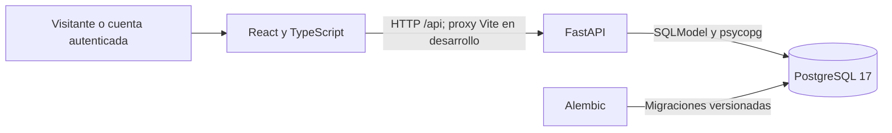

# Arquitectura y tecnologías

El frontend presenta formularios, catálogo, detalle y paneles privados. La API valida las entradas, comprueba la cuenta y sus permisos, calcula los contratos y conserva la información. PostgreSQL respalda relaciones, restricciones y transacciones; el cliente no asigna propietario, precio contratado, privilegios ni estados de reserva.

## Selección de tecnologías y relación con las pruebas

| Tecnología | Propósito y verificación |
| --- | --- |
| React y TypeScript | Interfaz por componentes y contratos tipados; Jest/React Testing Library comprueban interacciones y estados visibles |
| Vite | Servidor, proxy y build; CI verifica tipos y compila la aplicación |
| FastAPI y Pydantic | API y validación; Pytest/TestClient comprueban respuestas, permisos y errores |
| SQLModel, psycopg y PostgreSQL 17 | Persistencia y transacciones; pruebas con PostgreSQL real verifican restricciones, rollback y bloqueos |
| Alembic | Evolución del esquema; CI aplica migraciones y revisa correspondencia con modelos |
| Argon2 y JWT | Hash de contraseñas y sesión con vencimiento; pruebas de autenticación, privacidad y privilegios |
| Docker Compose | Arranque reproducible de frontend, backend y base de datos |
| GitHub Actions | Ejecuta build, migraciones y suites en PR/push hacia `develop` o `main` |

Jest es la herramienta principal de testing seleccionada; Pytest complementa la verificación del backend. Playwright está configurado para trabajo posterior, sin casos E2E actuales.

## Decisiones relevantes

- Una cuenta normal puede publicar espacios y reservar publicaciones ajenas. La relación con cada recurso determina el permiso.
- Los listados privados filtran por la cuenta verificada en el servidor. Un identificador o parámetro enviado por el navegador no permite consultar otra cuenta.
- Las reservas guardan precio unitario, duración y total del contrato; editar la tarifa del espacio no cambia esos importes.
- Crear reserva y pago pendiente usa un único commit. El bloqueo `SELECT FOR UPDATE` del espacio se comparte con su edición, cambio de estado y eliminación.
- La consulta calcula el estado efectivo según la hora del servidor. Una pendiente vencida deja de bloquear sin depender de que una tarea periódica cambie primero su fila.
- Eliminar requiere ausencia de cualquier reserva histórica. Si existe historial se ofrece desactivar y conservar.

## Estructura y referencias

| Ubicación | Contenido |
| --- | --- |
| `frontend/src/` | Componentes, cliente HTTP y pruebas Jest |
| `backend/app/` | Rutas, modelos, validación y reglas de negocio |
| `backend/tests/` | Pruebas Pytest y fixtures de PostgreSQL |
| `backend/migrations/` | Revisiones Alembic |
| `docs/` | Requerimientos, alcance por HU, identidad y fuentes de Wiki |
| `.github/workflows/ci.yml` | Pipeline de verificación |

El [repositorio en develop](https://github.com/JorgeJaceval/Pruebas-De-Software-RentSmart/tree/develop) contiene la implementación. FastAPI publica el contrato interactivo en `http://localhost:8000/docs`. Los detalles temporales y transaccionales están en [HU-12](https://github.com/JorgeJaceval/Pruebas-De-Software-RentSmart/blob/develop/docs/HU-12.md).
